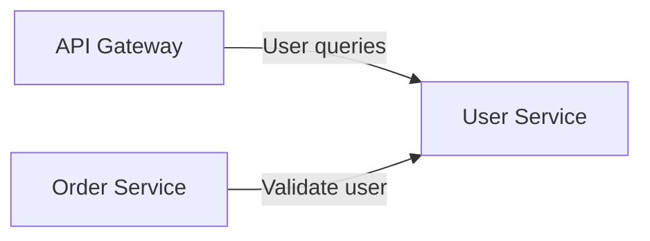

# NexusCart User Service

The User Service is a small read-only Go API that owns the customer seed data
used by the storefront and the Order Service.

## ✨ Highlights

- Go 1.26 and Gin.
- Deterministic seed data for three customers.
- List and lookup endpoints under `/api/v1/users`.
- End-to-end `X-Request-ID` propagation.
- Consistent JSON error responses.
- Versioned health reporting through `GET /health`.
- Multi-stage container build with a non-root runtime user.

## 🧭 Service Context



The API Gateway exposes user endpoints to clients. The Order Service also calls
this service directly before accepting a new order.

## 🔌 API

| Method | Path | Success | Description |
|---|---|---:|---|
| `GET` | `/health` | `200` | Service identity and deployed version |
| `GET` | `/api/v1/users` | `200` | All seeded users in an `items` array |
| `GET` | `/api/v1/users/{id}` | `200` | One user by ID |

An unknown user returns `404 USER_NOT_FOUND`.

## 🧪 API Examples

Read one user and propagate a caller-provided request ID:

```bash
curl -i \
  -H "X-Request-ID: docs-user-001" \
  http://localhost:8081/api/v1/users/usr-001
```

```json
{
  "id": "usr-001",
  "name": "Nguyen Van An",
  "email": "an@example.com"
}
```

A missing user uses the shared error contract:

```json
{
  "error": {
    "code": "USER_NOT_FOUND",
    "message": "User usr-999 does not exist",
    "requestId": "docs-user-001"
  }
}
```

The service returns the same request ID in the `X-Request-ID` response header.
If the caller does not provide one, the service creates one.

## 🚀 Quick Start

### Prerequisites

- Go 1.26.

```bash
go mod download
go run ./cmd/server
```

The service starts at <http://localhost:8081>. Verify it with:

```bash
curl http://localhost:8081/health
curl http://localhost:8081/api/v1/users
```

## 👥 Seed Data

| ID | Name | Email |
|---|---|---|
| `usr-001` | Nguyen Van An | `an@example.com` |
| `usr-002` | Tran Minh Chau | `chau@example.com` |
| `usr-003` | Le Hoang Nam | `nam@example.com` |

The repository is intentionally read-only. Restarting the service restores the
same data because no database or mutation endpoint is used.

## ⚙️ Runtime Configuration

| Variable | Default | Purpose |
|---|---|---|
| `PORT` | `8081` | HTTP listen port |
| `APP_VERSION` | `1.0.0` | Version returned by `GET /health` |
| `GIN_MODE` | Gin default | Set to `release` for container-style logging |

## ✅ Quality Gates

```bash
go test ./...
```

The test suite verifies health metadata, seed-data listing, common error
responses, and request ID propagation. The Docker build also runs the full test
suite before compiling the static Linux binary.

## 🐳 Container Image

```bash
docker build -t nexuscart-user-service:local .
docker run --rm -p 8081:8081 \
  -e APP_VERSION=local \
  -e GIN_MODE=release \
  nexuscart-user-service:local
```

The final Alpine image runs as an unprivileged `app` user and exposes port
`8081`.

## 🔁 CI/CD

`azure-pipelines.yml` owns this repository's variables and composes the local
`pipelines/stages/ci.yml`, `deploy-dev.yml`, and `deploy-prod.yml` stage
templates. It extends only the minimal shared contract in the GitHub `devops`
repository.

- Every branch runs `go test ./...`, builds the image, and scans it with Trivy.
- `main` publishes an immutable `$(Build.BuildId)` image to Azure Container
  Registry and promotes it through DEV and PROD with Helm verification.

## 📁 Repository Structure

```text
user-service/
├── cmd/server/main.go              # Process entry point
├── internal/
│   ├── httpx/error.go              # Shared error response writer
│   ├── requestid/middleware.go     # Request ID middleware
│   ├── server/router.go            # Routes and health endpoint
│   └── user/                       # User model, repository, and handlers
├── pipelines/stages/
│   ├── ci.yml                      # Test, build, scan, and ACR push
│   ├── deploy-dev.yml              # DEV deploy and verification
│   └── deploy-prod.yml             # Approval, PROD deploy, and verification
├── azure-pipelines.yml
├── Dockerfile
├── go.mod
└── go.sum
```
